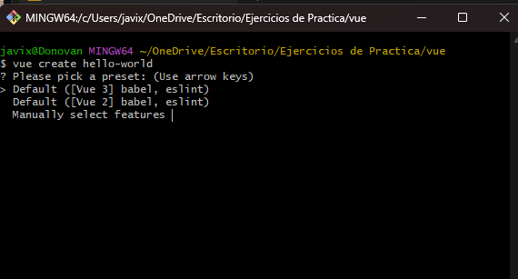

# Guía de Instalación y uso de VUE

## Paso único:

Abrir la consola de bash y ejecutar el comando:

`npm install -g @vue/cli` .

Corroborar instalación con

`vue --version` .

## Paso 1:

Crear la carpeta del proyecto:

`vue create mi-ejemplo`

PD: NO debes tener carpetas superiores con espacios ni caracteres raros, y tampoco puedes llamar a la carpeta del proyecto de esa manera.

Recomendado:todas las carpetas con minuscula.

TIP: Si te aparecen opciones al ejecutar el comando, elige la opción que contenga la mayor version. "Se selecciona presionando ENTER!!!"


Una vez terminado el proceso, recomiendo que NO ejecutes ningún comando adicional: EJ:
Te saldrá que puedes ejecutar:
`cd mi-ejemplo`
`npm install`
`npm run serve`

## Paso 2:

Abrir con Visual Studio Code la carpeta que crea VUE y dentro de Visual Studio abrir la terminal.

```
Ejecutar `npm install` si veo que la carpeta node_modules no está creada. Este comando te instalará las dependencias y te creara la carpeta /node_modules y el archivo package-lock.json
```


```
Ejecutar `npm run serve` para levantar un servidor local y poder correr nuestro proyecto en el navegador.
Este es un comando que hace algo MUY parecido a cuando abriamos un html con la extensión Live server.
```